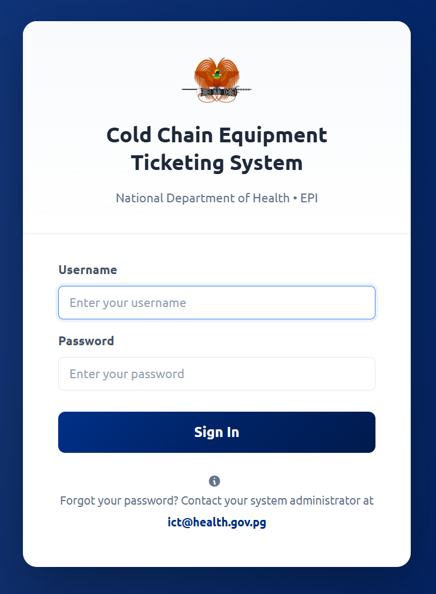
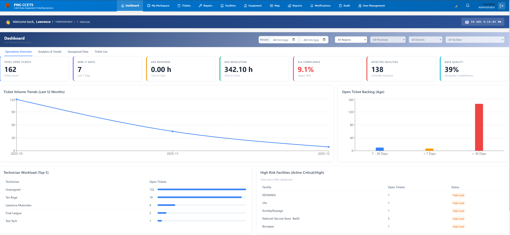
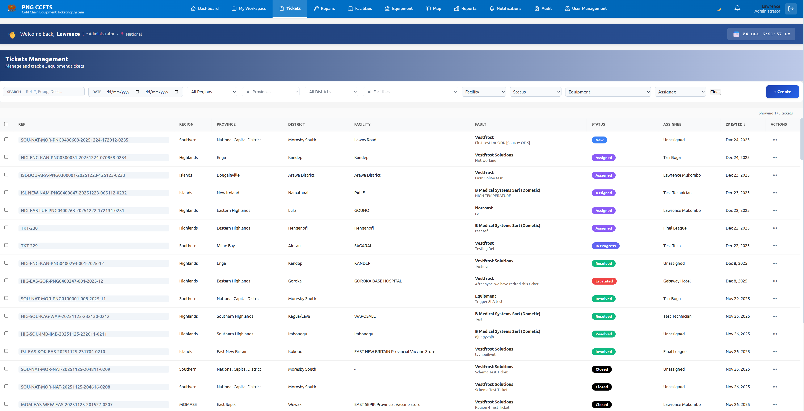

# PNG CCETS User Manual
**Cold Chain Equipment Ticketing System**

**Version:** 1.0  
**Date:** December 2025  
**URL:** [https://ccets.lamtoninvestments.com](https://ccets.lamtoninvestments.com)

---

## Table of Contents

1. [Introduction](#1-introduction)
2. [Getting Started](#2-getting-started)
    - [System Requirements](#system-requirements)
    - [Logging In](#logging-in)
3. [The Dashboard](#3-the-dashboard)
4. [Managing Tickets](#4-managing-tickets)
    - [Viewing Tickets](#viewing-tickets)
    - [Creating a Ticket (Web)](#creating-a-ticket-web)
    - [Updating & Resolving Tickets](#updating--resolving-tickets)
5. [Mobile App (ODK) Integration](#5-mobile-app-odk-integration)
    - [Submitting Reports via ODK](#submitting-reports-via-odk)
6. [Asset Management](#6-asset-management)
    - [Facilities](#facilities)
    - [Equipment](#equipment)
7. [User Management](#7-user-management)
8. [Troubleshooting](#8-troubleshooting)

---

## 1. Introduction

The **Cold Chain Equipment Ticketing System (CCETS)** is a centralized platform designed to manage the maintenance and repair of cold chain equipment (e.g., vaccine fridges) across Papua New Guinea. It connects facility officers, technicians, and national managers to ensure rapid response to equipment faults.

**Key Features:**
*   **Real-time Ticketing:** Track faults from report to resolution.
*   **Mobile Integration:** Submit reports offline using ODK Collect / KoboCollect.
*   **Asset Registry:** Comprehensive database of all health facilities and equipment.
*   **Offline Mode:** The web application works even with intermittent internet connections.

---

## 2. Getting Started

### System Requirements
*   **Web:** A modern browser (Chrome, Edge, Firefox, Safari).
*   **Mobile:** Any Android device with ODK Collect or KoboCollect installed.

### Logging In
1.  Navigate to **[https://ccets.lamtoninvestments.com](https://ccets.lamtoninvestments.com)**.
2.  Enter your **Username** (or Email) and **Password**.
3.  Click **"Sign In"**.

> **[Screenshot Placeholder]:**  
> *Please capture a screenshot of the Login Page and save it as `docs/images/login_page.png`.*
> 

---

## 3. The Dashboard

Upon logging in, you are greeted by the **Dashboard**. This provides a high-level overview of the system status.

**Key Components:**
*   **Stats Cards:** Show counts for *Total Tickets*, *Open Tickets*, *Critical Faults*, and *Active Technicians*.
*   **Ticket Status Chart:** A visual breakdown of tickets by status (New, Assigned, In Progress, Resolved).
*   **Map View:** An interactive map showing facilities with active tickets. Faulty equipment is marked with red indicators.
*   **Recent Activity:** A feed of the latest updates (e.g., "Ticket #235 created via ODK").

> **[Screenshot Placeholder]:**  
> *Please capture a screenshot of the Dashboard showing charts and the map. Save it as `docs/images/dashboard.png`.*
> 

---

## 4. Managing Tickets

The core of the system is the **Tickets** module.

### Viewing Tickets
Click **"Tickets"** in the left navigation menu.
*   **List View:** See all tickets with columns for ID, Facility, Priority, Status, and Date.
*   **Filtering:** Use the search bar or filters (e.g., "High Priority", "Pending Assignment") to find specific tickets.

> **[Screenshot Placeholder]:**  
> *Capture the Ticket List view. Save as `docs/images/ticket_list.png`.*
> 

### Creating a Ticket (Web)
1.  Click the **"New Ticket"** button.
2.  Select the **Facility** and the specific **Equipment**.
3.  Choose the **Fault Category** and **Priority**.
4.  Enter a detailed **Description**.
5.  Click **"Create Ticket"**.

### Updating & Resolving Tickets
Click on any ticket to open its **Detail View**.
*   **Assign Technician:** Managers can assign a specific technician to the job.
*   **Update Status:** Change status from *Open* -> *In Progress* -> *Resolved*.
*   **Add Notes:** Technicians can add work notes describing the repair.
*   **Close Ticket:** Once fixed, mark the ticket as *Closed*.

---

## 5. Mobile App (ODK) Integration

Field officers can report faults using the **ODK Collect** app on Android, even without internet.

### Submitting Reports via ODK
1.  Open **ODK Collect** on your device.
2.  Download the **PNG CCETS Form** (if not already downloaded).
3.  Fill out the form:
    *   Select your **Facility**.
    *   Scan or Select the **Equipment**.
    *   Describe the issue.
    *   Take a photo (optional).
4.  **Save & Finalize**.
5.  Back online? Go to **"Send Finalized Form"** and upload.

The system automatically receives the form and creates a Ticket on the Dashboard instantly.

---

## 6. Asset Management

### Facilities
Navigate to the **"Facilities"** tab to view the Master Facility List (MFL).
*   View facility details (Location, Type, Contact Info).
*   Correct or update coordinates if needed.

### Equipment
Navigate to **"Equipment"** to view the Cold Chain Equipment inventory.
*   **Search** by Serial Number or Model.
*   **View History:** See the entire repair history of a specific fridge.
*   **QR Codes:** Generate QR codes for equipment tagging.

> **[Screenshot Placeholder]:**  
> *Capture the Equipment Detail page. Save as `docs/images/equipment_detail.png`.*
> 

---

## 7. User Management

*(Admin Access Only)*
Navigate to **"User Management"** to add or modify system users.
*   **Create User:** Add new technicians or managers.
*   **Roles:** Assign roles (e.g., *National Admin, Provincial Manager, Technician*) to control access.
*   **Deactivate:** Remove access for users who have left.

---

## 8. Troubleshooting

### Password Reset
If you forget your password, contact your National Systems Administrator.

### "Connection Refused" or Offline
*   The application works offline! If you lose internet, you can still view cached data.
*   Changes made offline (like resolving a ticket) will sync when you reconnect.
*   If you see "Connection Refused" permanently, check your internet or contact support.

### ODK Sync Issues
*   Ensure your ODK settings point to the correct KoboToolbox server.
*   Check that you are listed as an authorized data collector.

---
**Technical Support**
For technical issues, please contact the IT Support Team at [Support Email/Phone].
